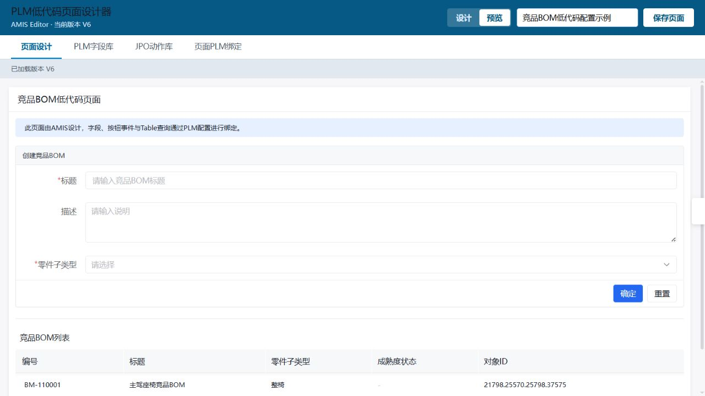
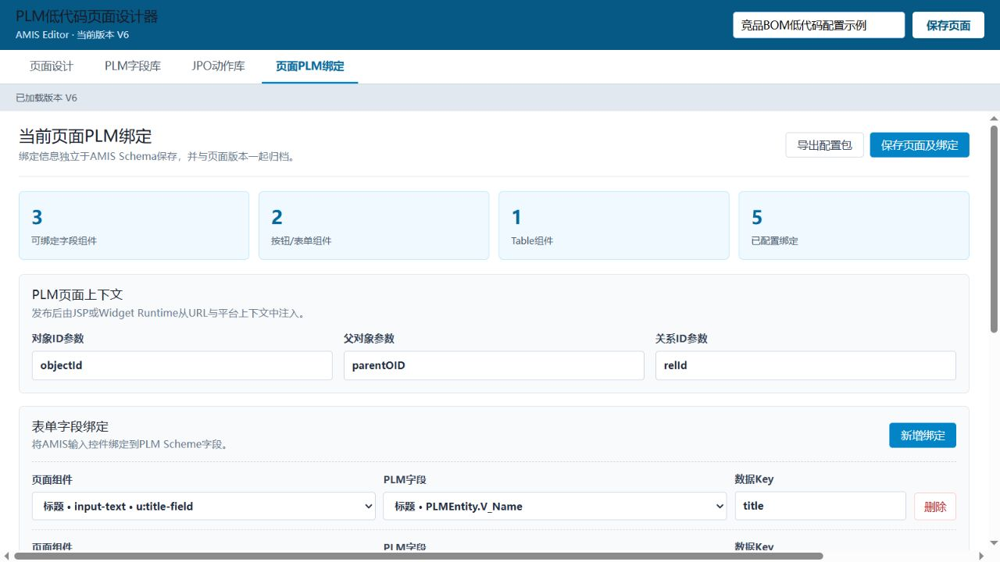

# PLM低代码设计器使用手册

版本：内部运行版 0.7
日期：2026-09-05

## 1. 功能定位

本系统用于通过 AMIS Editor 设计表单、Table 和展示页面，并为页面组件配置 3DEXPERIENCE/ENOVIA Scheme 字段及 JPO 动作绑定。

当前版本已经完成：

- AMIS 页面可视化设计与即时预览。
- 页面列表、空白新建、复制当前页面和页面切换。
- 页面软删除及确认提示，保留已保存内容与历史版本。
- 页面 JSON 保存及不可变历史版本。
- PLM Scheme 字段库维护。
- `actionCode → JPO名称/执行方法` 动作库维护。
- 表单控件与 PLM 字段绑定。
- 按钮或表单事件与 JPO 动作绑定。
- Table 查询动作、结果路径、对象 ID 和关系 ID 字段绑定。
- 页面 Schema 与 PLM 配置包导出。
- 当前页面一键发布到PLM Page对象。

当前版本的配置包可由 3DSpace JSP Runtime 和 Dashboard Widget Runtime 共同解析。编辑器服务器不直接执行 JPO；真实动作始终在登录用户所在的 PLM 环境执行。

## 2. 启动和访问

本项目根目录为 `D:\PLMLowCode`。编辑器在 `app`，PLM增量在 `plm`，Widget在 `dashboard/TWX_ENOPS_app`。

本地页面包目录：`D:\PLMLowCode\plm\3dspace\common\JFLowCode\pages`。
本文部署说明中的 `3dspace/common/...` 指服务器路径；本地对应路径需要加上 `D:\PLMLowCode\plm\`，不要把这个前缀加到浏览器URL中。

运行：

```powershell
D:\PLMLowCode\app\scripts\start-backend.ps1
```

浏览器访问：

```text
http://127.0.0.1:8080/
```

如果页面显示旧资源，使用 `Ctrl + F5` 强制刷新。

## 3. 页面设计

### 3.1 新建、复制与切换页面

1. 点击顶部导航“页面管理”，查看已保存的页面、编码和版本。
2. 点击“新建页面”，填写编码（例如 `JF_PART_QUERY`）和名称（例如“零件查询页面”）。
3. 编码只允许大写字母、数字、下划线，长度1～100；名称不能为空且最多200字。
4. 点击“创建并打开”，系统保存独立的V1页面并打开空白画布。编码已存在时会报错，不会覆盖原页面。
5. 拖入组件后点击“保存页面”，只更新当前编码的页面及其版本。
6. 回到“页面管理”，点击页面卡片可打开其他页面。未保存时会提示是否放弃修改；选择取消可继续编辑。

复制页面：先打开要复制的源页面，再进入“页面管理”点击“复制当前页面”。副本包含当前画布JSON和PLM绑定，但使用新编码、独立的V1版本，不复制源页面的历史版本。源页面有未保存修改时，确认后将这些内容复制到新页面，源页面数据库内容保持不变。

页面名称与画布标题是两项配置：顶部名称用于页面管理；画布标题在AMIS右侧属性中调整。编码创建后不能在界面修改。PLM字段库和JPO动作库是所有页面共享的，页面绑定则各自保存。

首次进入优先打开竞品BOM示例；如果示例不存在则打开最近更新的页面；无任何页面时显示页面管理。刷新或关闭浏览器时，未保存内容会触发浏览器提醒（以浏览器行为为准）。本版不提供自动草稿恢复。

### 3.2 删除页面

1. 进入“页面管理”，点击目标页面卡片下方的“删除页面”。
2. 确认框会显示名称和编码，请核对后点击“确认删除”；点击“取消”不改变页面。
3. 删除当前正在编辑的页面时，会同时退出该页面并清空编辑状态；未保存内容会明确提示将丢失。删除其他页面不会清空当前页面的修改。

本版采用软删除：页面从列表隐藏，正常读取返回404，旧窗口保存返回410；数据库中的页面JSON、PLM绑定和历史版本保留。删除后编码仍被占用，不能以相同编码创建新页。重复删除同一页面返回204，不会重复写历史版本。

本版暂无回收站和恢复按钮，误删后需要管理员核对记录再恢复。不影响已下载的JSON文件，也不会删除或下线PLM上的已部署页面。

### 3.3 编辑页面内容

1. 点击顶部“页面设计”。
2. 从左侧组件区选择表单、文本框、下拉框、按钮、Table 等组件。
3. 在中间画布选择组件。
4. 在右侧配置组件名称、数据 Key、标题、校验规则、布局和样式。
5. 建议为需要绑定 PLM 的表单字段填写唯一 `name`，例如 `title`、`description`、`partType`。
6. 点击顶部“保存页面”，Schema 和 PLM 绑定会共同保存并产生新版本。

AMIS Editor 会给组件生成稳定 ID，例如 `u:title-field`。页面PLM绑定通过该 ID 定位组件，组件调整位置不会导致绑定失效；删除组件后需要同步删除对应绑定。

## 4. 页面预览

在“页面设计”中点击顶部“预览”：

- 直接渲染当前内存中的页面 JSON，不要求先保存。
- 隐藏组件面板和属性面板。
- 可以查看表单、Table、布局、文字和按钮的基础效果。
- 点击“设计”返回编辑状态。



## 5. PLM字段库

“新增字段”用于重置右侧表单，会显示填写指引并聚焦字段编码；录入后点击“保存字段”才会保存。红色星号表示必填，空白或仅含空格不通过校验。保存失败会在表单内显示汇总提示及字段旁红色错误，并聚焦首个错误项。编码限1～100位大写字母、数字、下划线；Range配置还会校验JSON语法。

必填配置包括字段编码、显示名称、对象类型、字段来源、Scheme字段、数据类型、Range来源（其中下拉项已有默认值）。底部“必填”复选框是所定义业务字段的元数据，与当前配置表单必须填写哪些项是两回事。

点击顶部“PLM字段库”。

字段配置说明：

| 配置项 | 说明 | 示例 |
| --- | --- | --- |
| 字段编码 | 低代码平台内部唯一编码 | `PART_TYPE` |
| 显示名称 | 设计人员可识别的名称 | 零件子类型 |
| 对象类型 | 字段所属 PLM Type，`*` 表示通用 | `JF_CompetitiveBOM` |
| 字段来源 | BASIC、ATTRIBUTE、RELATIONSHIP、PROGRAM | ATTRIBUTE |
| Scheme字段 | PLM真实字段或Select表达式对应名称 | `JF_VPMReference.JF_PartType` |
| 数据类型 | 文本、数字、日期、枚举等 | enum |
| 国际化Key | PLM已有资源文件 Key | `emxFramework.Attribute.JF_PartType` |
| Range来源 | 无、固定选项、PLM属性Range、PLM Policy状态、JPO | PLM_RANGE |
| Range配置JSON | 固定选项、PLM属性名、Policy名或JPO Range参数 | `{"attributeName":"JFAffectsFactory"}` |
| 必填/可编辑/多值 | 字段元数据 | 按Scheme填写 |

固定下拉选项示例：

```json
{
  "options": [
    {"label": "整椅", "value": "C"},
    {"label": "面套", "value": "T"},
    {"label": "发泡", "value": "U"}
  ]
}
```

## 6. JPO动作库

“新增动作”同样显示指引；保存时提供逐项校验提示。动作编码、动作名称、动作类型、请求方式必填；非“页面跳转”动作还要求JPO名称和执行方法，星号随动作类型变化。输入/输出映射JSON语法错误会分别标注在对应输入框旁。

点击顶部“JPO动作库”。

动作库由开发人员或管理员维护。页面设计人员只选择 `actionCode`，不直接输入任意 JPO。

| 配置项 | 说明 | 示例 |
| --- | --- | --- |
| 动作编码 | 页面调用的唯一白名单编码 | `CREATE_COMPETITIVE_BOM` |
| 动作名称 | 业务名称 | 创建竞品BOM |
| 动作类型 | CREATE、UPDATE、QUERY、ACTION、NAVIGATION | CREATE |
| 请求方式 | Runtime调用动作页使用的方法 | POST |
| JPO名称 | Spinner/JPO程序名，不含 `_mxJPO` | `JF_CompetitiveBOM` |
| 执行方法 | JPO公开方法 | `createCompetitiveBOM` |
| 输入映射 | 页面数据和上下文到JPO参数的映射 | `{"title":"${title}"}` |
| 输出映射 | JPO返回结果到标准数据的映射 | `{"objectId":"data.objectId"}` |
| 启用 | 禁用后页面不能选择或执行该动作 | true |

查询动作应统一返回：

```json
{
  "status": 0,
  "msg": "",
  "data": {
    "items": [],
    "total": 0
  }
}
```

创建或更新动作应统一返回：

```json
{
  "status": 0,
  "msg": "创建成功",
  "data": {
    "objectId": "21798.25570.25798.37575",
    "name": "BM-110001"
  }
}
```

## 7. 页面PLM绑定

点击顶部“页面PLM绑定”。系统会扫描当前 AMIS Schema 中带 ID 的组件，并按用途分组。



### 7.0 本页资源选取（0.6新增）

顶部“公共PLM字段库”和“公共JPO动作库”维护共享定义；“页面PLM绑定”顶部会明确显示当前页面名称和编码。

1. 在“本页字段”左侧按对象类型筛选，输入名称、字段编码或Scheme属性关键字，点击“选入”。指定类型时同时包含`*`通用字段；可以依次选入多个对象类型。
2. 右侧显示已选入本页的字段。下方“表单字段绑定”的PLM字段下拉只显示这份清单中定义仍存在的字段。
3. 在“本页动作”按创建、更新、查询等类型筛选，也可搜索动作名称、编码、JPO名称或方法名，点击“选入”。禁用动作不出现在候选列表。
4. 下方初始化查询和Table查询只允许选择本页启用的QUERY动作；事件绑定可选择其他类型动作。
5. 点击“保存页面及绑定”。未保存时切换页面会触发现有的放弃修改提醒；复制页面会复制本页资源清单，导出配置包也包含清单。

资源仅选入不代表已绑定组件，也不会执行JPO。对象类型筛选只是候选筛选，不是权限判断，也不会限制整个页面的数据类型。

已被字段、初始化查询、事件或Table绑定使用的资源禁止直接移除，请先删除对应绑定。移除仅影响本页清单，不删除公共定义。公共定义缺失或动作被禁用时，会保留已有引用并显示提示，不会自动替换成其他字段/动作。

旧页面加载时，自动从现有绑定恢复本页清单，不修改已有绑定；首次保存后随页面版本持久化。新增配置为`plmConfig.fieldCodes`和`plmConfig.actionCodes`，无需数据库表结构迁移。公共定义本身仍是共享、非版本锁定的；本次未实现发布快照。

### 7.1 页面上下文参数

配置运行时 URL 参数名称：

- 对象 ID：默认 `objectId`。
- 父对象 ID：默认 `parentOID`。
- 关系 ID：默认 `relId`。

JSP 和 Widget Runtime 应将这些参数转换为统一的 `plmContext`。

### 7.2 表单字段绑定

1. 点击“新增绑定”。
2. 选择 AMIS 页面组件。
3. 选择 PLM 字段库中的 Scheme 字段。
4. 填写页面数据 Key。

示例：

```text
页面组件：标题 · input-text · u:title-field
PLM字段：标题 · PLMEntity.V_Name
数据Key：title
```

### 7.3 页面初始化查询

1. 在页面设计中加入带稳定组件ID的 AMIS Service。
2. 将类型为 QUERY 的动作选入本页动作清单。
3. 点击“新增初始化查询”，选择Service组件和查询动作。
4. 保存页面及绑定。

运行时在页面打开时为Service注入受控的`plm://actionCode` API。JSP或Widget适配器会同时传入当前`plmContext`，查询返回的`data`进入Service数据域，内部组件可使用`${header.title}`等变量。Schema中已有的Service API会被绑定配置覆盖。

### 7.4 按钮与表单事件

1. 选择按钮或表单组件。
2. 选择点击、提交或值变化事件。
3. 选择 JPO 动作库中的 actionCode。
4. 配置成功后的页面行为。

成功后行为包括：

- 不处理。
- 刷新页面或Table。
- 关闭弹窗。
- 使用返回的 `data.objectId` 打开对象详情。

### 7.5 Table查询和对象ID

1. 选择 Table、Table 2.0 或 CRUD 组件。
2. 选择类型为 QUERY 的 JPO 动作。
3. 配置列表数据路径，默认 `data.items`。
4. 配置总数路径，默认 `data.total`。
5. 配置每行对象 ID 字段，默认 `objectId`。
6. 配置每行关系 ID 字段，默认 `relId`。

后续行按钮可以通过当前行的 `objectId` 打开详情或执行JPO，通过 `relId` 操作连接关系。

## 8. 保存与版本

“保存页面”和“保存页面及绑定”执行相同的版本操作：

- 更新 `lc_page` 当前版本。
- 向 `lc_page_version` 写入不可变历史版本。
- 同一个版本同时保存 AMIS Schema 和 PLM Config。

因此回退页面时，不会出现页面布局已经回退但PLM动作仍是新配置的问题。

## 9. 导出配置包

在“页面PLM绑定”点击“导出配置包”，生成：

```text
JF_COMPETITIVE_BOM_CREATE-V6.json
```

导出使用当前页面的真实编码。未保存修改也可导出，但文件名使用 `页面编码-DRAFT.json`，导出不会自动保存数据库；需要正式版本文件时先保存再导出。

配置包结构：

```json
{
  "formatVersion": 1,
  "pageCode": "JF_COMPETITIVE_BOM_CREATE",
  "pageName": "竞品BOM低代码配置示例",
  "version": 6,
  "schema": {},
  "plmConfig": {
    "context": {},
    "fieldBindings": [],
    "dataBindings": [],
    "actionBindings": [],
    "tableBindings": [],
    "searchBindings": []
  }
}
```

该结构可以同时供 3DSpace JSP Runtime 和 Dashboard Vue Widget Runtime 使用，不需要生成两份页面JSON。导出后将文件名调整为页面编码，例如 `JF_COMPETITIVE_BOM_CREATE.json`，部署到 `3dspace/common/JFLowCode/pages/`。

### 9.1 发布到PLM

1. 将`app/docs/plm-integration.example.yml`复制为根目录`config/plm-integration.yml`，填写目标PLM地址、SecurityContext和`X-3DSLogin-ticket`。真实配置已被Git忽略，禁止提交。
2. 修改配置后重启Spring Boot后端；前端不保存PLM地址或Ticket，也不需要重新构建。
3. 打开待发布页面，点击顶部“发布到PLM”。存在未保存修改时，系统先保存为新版本。
4. Spring Boot读取当前已保存页面，通过`TWXTicketService`调用`JF_LowCodePage:publishPage`；成功后创建或覆盖与`pageCode`同名的Page对象。
5. 使用`/3dspace/common/JF_LowCodeRuntime.jsp?pageCode=页面编码`重新打开页面即可读取新内容，无需重启3DSpace。

发布是覆盖式部署，PLM Page本身不保存历史版本；需要回退时从编辑器的历史版本恢复后重新发布。Ticket过期、PLM地址不可达、JPO未部署或配置的SecurityContext无Page管理权限时，发布不会成功。

本机配置结构：

```yaml
plm:
  integration:
    base-url: https://your-plm-host/3dspace
    security-context: VPLMProjectLeader.YourCompany.YourOrganization
    login-ticket: REPLACE_WITH_X_3DSLOGIN_TICKET
```

## 10. 运行端部署与验证

3DSpace需要部署：

- `common/JF_LowCodeRuntime.jsp`：3DSpace页面入口。
- `common/JF_LowCodeAction.jsp`：受控动作入口。
- `common/JF_LowCodePage.jsp`：读取已发布Page内容。
- `common/JFLowCode/runtime.js`：JSP与Widget共用的配置编译和动作分发逻辑。
- `common/JFLowCode/amis/`：固定版本的AMIS离线SDK。
- `common/JFLowCode/pages/`：设计器导出的页面配置包。
- `JF_LowCode` JPO：低代码业务查询，本版提供当前用户DA列表查询。
- `JF_LowCodePage` JPO：Page配置包发布和读取。
- `TWX_RestJPOWhiteList` Page：必须包含`JF_LowCodePage`和`JF_LowCode`，否则TicketService会拒绝发布和查询请求。

3DSpace访问示例：

```text
/3dspace/common/JF_LowCodeRuntime.jsp?pageCode=JF_COMPETITIVE_BOM_CREATE
```

Widget侧加载同一个页面配置包和 `runtime.js`，但动作适配器可复用Widget已有REST。例如当前竞品BOM示例在Widget中复用现有 `createVPMReferenceV5ByRest`，在3DSpace中通过受控Action JSP调用JPO。

### 10.1 3DSpace原生搜索配置

在“页面PLM绑定”中新增“3DSpace原生搜索”，选择触发搜索的AMIS按钮、回填表单、对象ID字段和显示名称字段，然后填写`emxFullSearch.jsp`查询参数。多个参数使用`&`连接，例如DA项目搜索：

```text
field=TYPES=type_ProjectSpace&table=AEFGeneralSearchResults&includeOIDprogram=JF_PublicMethodClass:getSystemAllProjectSpaces&showInitialResults=true&selection=single
```

`field`中的类型、状态等过滤条件，以及`table`、`form`、`includeOIDprogram`、`excludeOIDprogram`、`showInitialResults`、`suiteKey`等参数由Runtime透传给3DSpace。为保证回填链路不可被页面配置替换，Runtime会忽略配置中的`submitURL`和`requestId`，写入统一回调地址和本次搜索的唯一标识；当前版本只支持单选，因此`selection`固定为`single`。

搜索完成后，统一回调JSP把所选项目的对象ID写入隐藏字段（如`projectId`），把项目显示名称写入可见字段（如`projectName`）。这些字段随表单一起提交给绑定的创建动作。

运行端只允许已登记的 `actionCode`。页面配置包中的JPO名称、方法名、Type、Policy或MQL即使被人为篡改，也不会直接执行。

### 10.2 本版TicketService接口

查询当前登录用户拥有的DA：

```text
POST /3dspace/TWXPublicRest/TWXTicketService?JPOName=JF_LowCode&FuncName=getCurrentUserDAListLowCode
```

请求体示例为`{"page":1,"perPage":20}`，返回数据包含`items`和`total`；JPO查询条件固定为`type=JFDA`且`owner=context.getUser()`，不会因为DA管理员角色扩大为全部数据。

创建DA申请单：

```text
POST /3dspace/common/JF_LowCodeAction.jsp?actionCode=CREATE_DA
```

Runtime将表单中的`projectId`、`title`、`changeType`、`projectPhase`、`affectedPlant`、`deviationReason`、`beforeChange`和`afterChange`提交给`JF_LowCode:createDALowCode`。JPO使用`type_JFDA`对象生成器创建真实DA对象，写入原生`JFCreateNewDAForm`对应属性并通过`JFChange2Project`连接项目。创建和关联位于同一事务，任一步失败都会回滚。表单配置`reload: "daList"`，成功后只刷新DA表格，不刷新整个Runtime页面。

发布页面包：

```text
POST /3dspace/TWXPublicRest/TWXTicketService?JPOName=JF_LowCodePage&FuncName=publishPage
```

请求体就是导出的完整配置包。读取Page可调用`JF_LowCodePage:getPublishedPage`并传入`{"pageCode":"JF_DA_LIST_DEMO"}`；3DSpace Runtime通常直接访问`JF_LowCodePage.jsp?pageCode=...`，由该JSP完成内容读取。

设计器调用的是自身后端接口：

```text
POST /api/pages/{pageCode}/publish
```

Spring Boot从数据库读取该页面当前已保存版本，组装完整配置包，再根据`config/plm-integration.yml`直连上述TicketService接口。TicketService即使返回带达索HTML/script前缀的文本，后端也会提取末尾JSON后判断发布结果。

### 10.3 AMIS Table前端排序和过滤

AMIS CRUD列支持`sortable`、`searchable`和`filterable`；工具栏支持`filter-toggler`。默认服务端分页模式下，这些操作只把`orderBy`、`orderDir`和过滤条件传给查询接口，不会自动处理数据。

如果明确要求只在浏览器过滤和排序，需要让接口一次返回完整数据，并配置：

```json
{
  "type": "crud",
  "loadDataOnce": true,
  "loadDataOnceFetchOnFilter": false,
  "filterTogglable": true,
  "headerToolbar": ["filter-toggler"],
  "columns": [
    {"name": "title", "label": "标题", "sortable": true, "searchable": true},
    {
      "name": "attribute[JFChangeType]",
      "label": "变更类型",
      "filterable": {"options": ["客户需求", "设计偏差", "工艺偏差", "VAVE"]}
    },
    {"name": "createdAt", "label": "创建时间", "type": "datetime", "sortable": true}
  ]
}
```

前端模式只能过滤已经加载到浏览器的数据，不适合大数据量。日期排序应让查询接口同时返回可稳定比较的ISO时间或时间戳，避免按本地化日期字符串排序产生错误。DA示例已启用`loadDataOnce`并通过`api.data.clientSide=true`要求查询JPO一次返回当前用户的全部DA；首次加载后，切换分页、点击列标题排序、展开筛选栏及重置筛选均不重复请求JPO。CRUD同时启用`autoFillHeight=true`，切换到50或100条时只滚动Table数据区，筛选、工具栏和分页不会把3DSpace外层页面撑高；设置`autoJumpToTopOnPagerChange=false`，避免切换页码或每页数量时将3DSpace外层Navigator自动滚动到顶部。

DA新建表单的“影响工厂”使用AMIS多选下拉框，并绑定公共字段`AFFECTED_PLANT`。该字段的Range来源配置为`PLM_RANGE`，Range配置为`{"attributeName":"JFAffectsFactory"}`。发布时后端只把本页已引用字段的定义快照放入页面包；Runtime打开页面时通过受控动作`QUERY_PAGE_FIELD_METADATA`一次取得当前PLM语言下的字段标题和Range `label/value`。因此PLM调整国际化资源或工厂Range后不需要重新设计或发布页面，重新打开页面即可取得新内容。AMIS `mapping`对数组值会逐项映射，因此JPO返回的多值属性如果为`StringList`并被JSON序列化为数组，也不需要业务JPO额外生成国际化字段。

DA列表支持勾选一条或多条记录后执行“删除”。页面通过AMIS CRUD的`bulkActions`把选中行的`id`汇总为`ids`，由受控动作`DELETE_DA`调用`JF_LowCode:deleteDALowCode`。后端会先逐条校验对象类型必须为`JFDA`、所有者必须是当前用户、状态必须精确为`In_Work`；全部通过后才在同一事务中删除，任一项不符合时整批回滚。删除成功后页面自动刷新`daList`，无需重新打开页面。

Runtime将多选结果按数组提交，`JF_LowCode:createDALowCode`再次从Scheme动态读取`JFChangeType`、`JFProjectPhase`和`JFAffectsFactory`的合法Range；影响工厂去重后按PLM现有逗号分隔格式写入多值属性，显示标签不写入业务对象。新增或调整这些属性的Range后不需要修改创建JPO的固定白名单。其他Range字段复用同一机制时，只需在公共字段库中选择“PLM属性Range”、填写实际属性名，并将页面控件绑定到该字段，不需要修改Runtime或业务页面JSON。

DA列表工具栏中的“筛选”用于展开或收起查询条件。填写标题、变更类型或项目阶段后，需要点击条件区右侧的“执行筛选”才会应用前端过滤；“重置”用于清除条件并恢复全部已加载数据。由于筛选表单使用`wrapWithPanel=false`，执行按钮必须放在表单`body`内的`button-toolbar`中，不能依赖会被AMIS隐藏的底部`actions`按钮栏。

查询JPO直接返回ENOVIA标准`MapList`，不需要逐行组装页面别名。基础字段直接使用`id`、`name`、`current`、`owner`、`originated`等标准key，属性直接使用`attribute[JFChangeType]`等select key；AMIS列、排序和筛选使用相同的原始key。在“页面PLM绑定→Table查询与对象ID→列字段与国际化”中，为每个需要PLM国际化的Table列选择对应的公共字段。Runtime据此自动替换列标题，并将属性Range或Policy状态原值映射为当前语言显示值，原始业务值不会被改写。

表单控件同样通过“表单字段绑定”取得PLM国际化标题和Range选项。公共字段的“国际化Key”默认从`emxFrameworkStringResource`读取；以`emxComponents.`开头时自动读取`emxComponentsStringResource`，特殊资源包可使用`资源包名::Key`格式。未配置或未命中时回退到设计器中的“显示名称”。

## 11. 当前示例效果

系统内置“竞品BOM低代码配置示例”：

- 创建表单：标题、描述、零件子类型。
- 标题绑定 `PLMEntity.V_Name`。
- 描述绑定 `description`。
- 零件子类型绑定 `JF_VPMReference.JF_PartType`。
- 表单提交绑定 `CREATE_COMPETITIVE_BOM`。
- 创建成功配置为打开返回对象详情。
- Table绑定 `QUERY_COMPETITIVE_BOM`。
- Table行对象ID字段为 `objectId`，关系ID字段为 `relId`。

## 12. 当前边界和后续工作

进入真实PLM运行前仍需开发：

- PLM字段库从Scheme自动同步（当前已可手工维护并在运行时动态解析国际化）。
- 动态页面、字段和按钮权限。
- 自动草稿恢复、可视化历史回退和多目标环境管理（单目标Page发布已完成）。

新增页面在设计器中可以保存、预览、导出和发布；其中业务请求仍受Runtime动作白名单约束，JSON中的JPO名称和方法名不会被直接执行。

无论前端是否隐藏按钮或字段，真实写入JPO都必须再次检查当前用户、对象状态、角色和字段权限。
